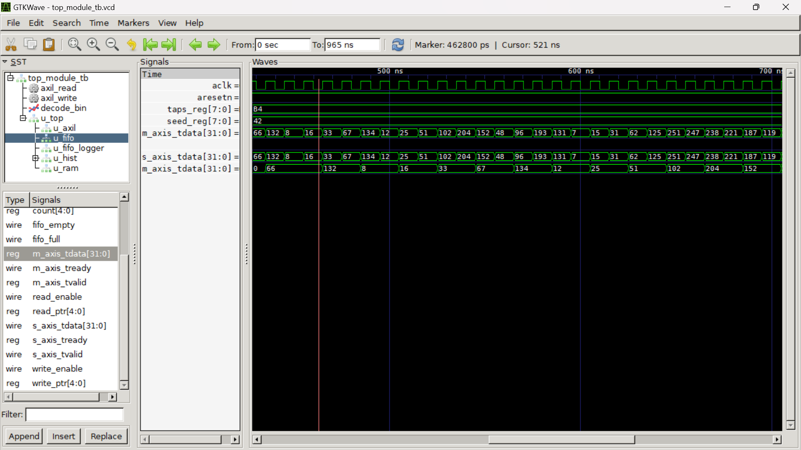
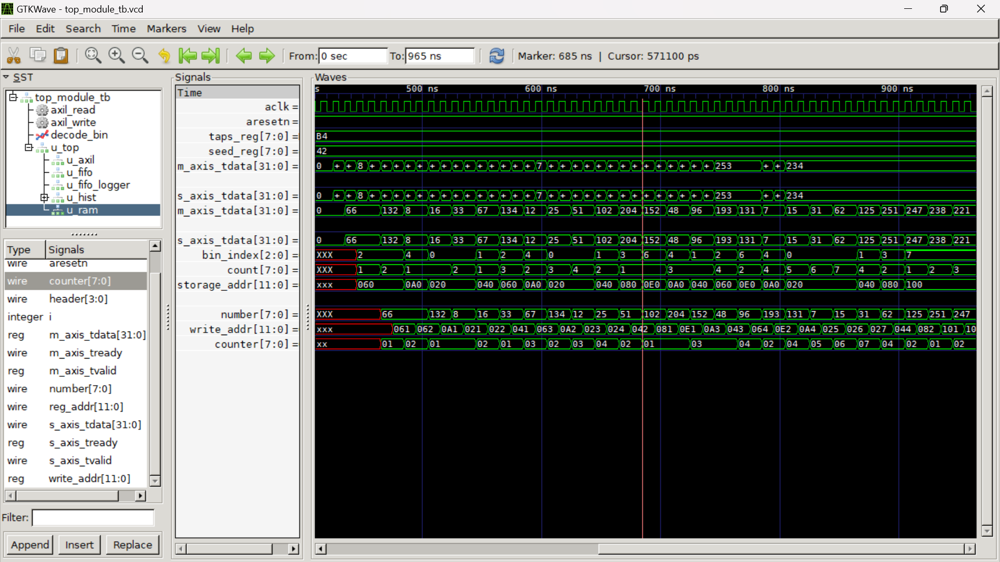
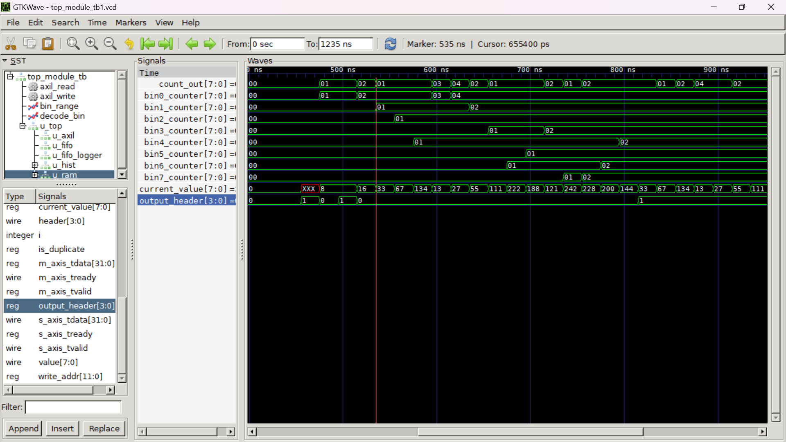

# **AXI-Based Top Module Simulation**

## **Overview**
This project implements an **AXI-based top module** consisting of several submodules:
- **axi_ram**: Stores incoming data, detects repetitions, and outputs processed results.
- **top_module_full**: Integrates **LFSR, FIFO, Histogram, and RAM**.
- **Testbench (`top_module_tb`)**: Simulates and verifies functionality.

The project supports an **AXI-Lite interface** for LFSR configuration and an **AXI-Stream interface** for data flow between modules.

---

## **Module Descriptions**

### **1. AXI RAM (`ramnew.v`)**
- Stores data received via **AXI-Stream**.
- Detects **duplicate values** and avoids redundant storage.
- Computes **memory addresses** dynamically.
- Outputs stored values along with metadata.

#### **Enhancements in AXI RAM**
- **Duplicate Detection using `number_seen` Register**  
  - A **256-bit register array** (`number_seen`) tracks which numbers have already been stored.  
  - If a number is encountered for the first time, it is stored in RAM.  
  - If the number is seen again, it is **not stored** but instead marked as a **duplicate**.  

- **Storage Address Tracking (`number_address`)**  
  - Each unique value gets an **address assigned** from its respective bin.  
  - If a **duplicate** number appears, its **previously stored address** is retrieved.  

- **New `output_header` Field in Output Packets**  
  - *`4'b0000`* → **New unique value** stored in RAM.  
  - *`4'b0001`* → **Duplicate value**, output previous storage address instead.  

#### **Input Packet Format (from Histogram)**
*{ 4'b0000, bin_count (8 bits), base_storage_addr (12 bits), stored_value (8 bits) }*

Each input packet consists of:
- **4-bit header** (*0000*) → Standard packet from histogram.
- **8-bit bin counter** → Bin occupancy count.
- **12-bit base storage address** → Memory region where data is stored.
- **8-bit stored value** → The actual value being stored.

#### **Enhanced Output Packet Format (to Master Interface)**
*{ output_header (4 bits), bin_count (8 bits), final_storage_addr (12 bits), stored_value (8 bits) }*

| `output_header` | Description |
|---------------|-------------|
| **`4'b0000`** | **Unique value** stored for the first time. |
| **`4'b0001`** | **Duplicate value**, retrieve stored address. |

---

### **2. LFSR (`lfsrnew.v`)**
- Implements a **Linear Feedback Shift Register (LFSR)** for generating **pseudo-random numbers**.
- Configurable via **AXI-Lite interface**.
- Used for **generating test data** that is stored in RAM.

#### **Features:**
- Can be initialized with a **seed value**.
- Generates **8-bit pseudo-random numbers**.
- Uses **XOR feedback** with predefined taps for randomness.

#### **AXI-Lite Control Signals:**
- *s_axi_awaddr*: Write address for configuration.
- *s_axi_wdata*: Data to be written (seed, enable, etc.).
- *s_axi_rdata*: Read output.

---

### **3. Histogram Processor (`histnew.v`)**
- Categorizes incoming values into **8 bins**.
- Maintains a **counter** for each bin.
- Computes **bin address offsets** dynamically.

#### **Functionality:**
- Takes **input values from LFSR** and assigns them to **bins**.
- Increments **counters** corresponding to each bin.
- Sends **bin index, counter address, storage address, and value** to RAM.

#### **Output Format:**  
*{ 4'b0000, bin_count (8 bits), base_storage_addr (12 bits), stored_value (8 bits) }*

---

### **4. FIFO Buffer (`fifonew.v`)**
- Implements a **First-In-First-Out (FIFO)** buffer for **intermediate data storage**.
- Used for **smoothing data flow** between modules.
- Operates on the **AXI-Stream** interface.

#### **Features:**
- Handles **AXI-Stream transactions**.
- Provides **temporary storage** for histogram data before sending it to RAM.
- Ensures **data consistency and prevents data loss** in high-speed streaming.

#### **Signals:**
- *s_axis_tdata*: Input data to FIFO.
- *s_axis_tvalid*: Data valid signal.
- *m_axis_tdata*: Output data from FIFO.
- *m_axis_tvalid*: Output data valid signal.

---

### **5. FIFO to Text Logger (`fifototxt.v`)**
- Captures **FIFO output data** and writes it to a **text file**.
- Used for **debugging** and verifying data flow.

#### **Functionality:**
- Reads data from the **FIFO output stream**.
- Writes values to a **log file (`fifo_output.txt`)**.
- Useful for **analyzing system performance** and debugging.

---

### **6. Top-Level Module (`top_module_full.v`)**
- Integrates **LFSR, FIFO, Histogram, and RAM** into a single pipeline.
- Handles **AXI-Lite control** for configuring LFSR.
- Routes data through the **processing pipeline**.

#### **Modules Integrated:**
- **LFSR** (Linear Feedback Shift Register)
- **FIFO Buffer**
- **Histogram Processor**
- **RAM Storage**
- **FIFO Logger** (Writes FIFO output to a text file)

#### **Output Packet Format:**  
*{ 4'b0000, bin_count (8 bits), storage_addr (12 bits), processed_value (8 bits) }*

---

## **Testbench (`tbnew.v`)**
- Simulates the **full system**.
- Configures **LFSR via AXI-Lite**.
- Monitors **RAM outputs via AXI-Stream**.
- Validates expected results.

### **Test Process:**
1. **Reset system** (*aresetn* low, then high).
2. **Configure LFSR** via AXI-Lite writes.
3. **Start LFSR** and enable streaming.
4. **Capture and analyze AXI-Stream outputs**.
5. **Stop LFSR** and verify output cessation.

---

## **Waveforms**

  
  
### repetation example 

| Signal Name       | Description                         |
|-------------------|-------------------------------------|
| **aclk**         | System clock                        |
| **aresetn**      | Active-low reset                    |
| **s_axi_awaddr** | AXI write address                   |
| **s_axi_wdata**  | AXI write data                      |
| **s_axi_rdata**  | AXI read data                       |
| **m_axis_tdata** | Output stream data                  |
| **m_axis_tvalid** | Output stream valid                |

---

## **Summary of Enhancements**
✔ **Efficient Memory Utilization** – Only unique values get stored.  
✔ **Prevents Redundant Data** – Duplicates are simply referenced instead of re-storing.  
✔ **Maintains Compatibility** – Same interface, but improved logic.  

This ensures **optimized RAM usage** while maintaining correct **data flow** and **AXI-Stream integrity** in the system. 🚀  

---

## **Author**
**Mukul Paliwal**  
**This project is part of IRIS LABS HARDWARE SUBMISSIONS**
