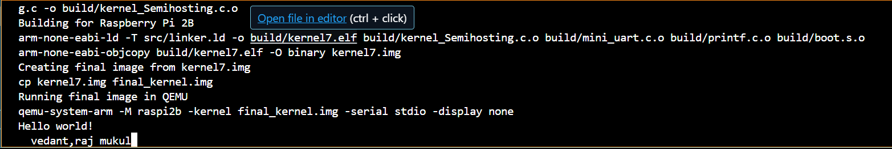

# 🧪 Task 1 – UART-Based Serial Output in EL1

## 📌 Objective

Build a **bare-metal kernel** for the **Raspberry Pi Model B (QEMU-emulated)** that:

- Runs entirely in **EL1 (privileged mode)**
- Uses **memory-mapped I/O (MMIO)** to control **UART0**
- Sends the message *"Hello World"* to the UART serial monitor
- Implements a custom `printf()` function without using any standard C library

---

## 🧠 Core Concepts

- **EL1**: All operations are executed in *privileged mode*.
- **MMIO**: Registers like UART control/status/data are accessed directly via memory addresses.
- **Bare-metal environment**: No OS, no standard library. All drivers and runtime are custom written.
- **Custom printf**: Only supports strings, and each call prints *exactly 4 characters* at a time.

---

## 🗂️ Project Structure

```
task1final/
├── include/
│   ├── base.h            # Base macros and utility defines
│   ├── gpio.h            # GPIO base address and config (not used in Task 1)
│   ├── mini_uart.h       # MMIO register map and UART function declarations
│   ├── mm.h              # MMIO access macros for read/write 
│   ├── printf.h          # Custom uart_printf() declaration
│   └── output/           # (Reserved for future output redirection modules)
├── src/
│   ├── boot.S            # Entry point, sets up stack and jumps to kernel_main()
│   ├── kernel_Semihosting.c # Kernel logic: UART init, print message, echo input
│   ├── mini_uart.c       # UART0 driver: init, putc, getc 
│   ├── printf.c          # Custom implementation of uart_printf (4-char string only)
├── linker.ld             # Linker script defining memory layout
├── makefile              # Build script using GNU tools
├── kernel7.img           # Final binary to be run in QEMU
└── README.md             # You're here!
```

---

## 🗞️ Breakdown of Key Files

| File                   | Description                                                                                                               |
|------------------------|---------------------------------------------------------------------------------------------------------------------------|
| `boot.S`               | Assembly file that sets up the execution context, stack pointer, and switches to EL1. Calls `kernel_main()`.              |
| `kernel_Semihosting.c` | Main C file. Initializes UART and sends *"Hello World\nNITR, Vedam Aj Mukul"* using 4-character chunks via `uart_printf()`. |
| `mini_uart.c`          | Implements UART0 initialization and MMIO-based character send/receive using physical memory addresses.                    |
| `printf.c`             | Implements `uart_printf()` which takes *only 4-character strings*. No formatting or variable arguments supported yet.     |
| `mm.h`                 | Provides mmio base address.                                 |
| `linker.ld`            | Specifies the memory layout for placing `.text`, `.bss`, and `.data` sections correctly.                                  |
| `makefile`             | Compiles and links everything into `kernel7.img`. Cleans up intermediate object files.                                    |

---

## 📌 Output

Once successfully built and run on QEMU, the UART monitor will print:

```
Hello World
```

*Then, the kernel enters an infinite loop that echoes every character typed back to the UART.*

---

## 🛠️ Build Instructions

*make*

*Compiles all sources, links the final ELF file, and produces `kernel7.img`.*

---

## ▶️ Run Instructions (Using QEMU)

*qemu-system-arm -M raspi2b -kernel kernel7.img -serial stdio -display none*

*This runs the kernel in a Raspberry Pi 2 model using QEMU and connects serial output to your terminal.*

---


## ✨ Features

- Fully custom `uart_init`, `uart_putc`, `uart_getc`
- Minimal UART printf with fixed-size 4-character strings
- Works entirely in EL1 without using semihosting or standard libraries
- Echo mode: type anything and see it echoed back on screen

---

## 🙋‍♂️ Credits  
- **Testing**: QEMU on WSL2
- **This project is part of IRIS Hardware recruitments by MUKUL PALIWAL**
